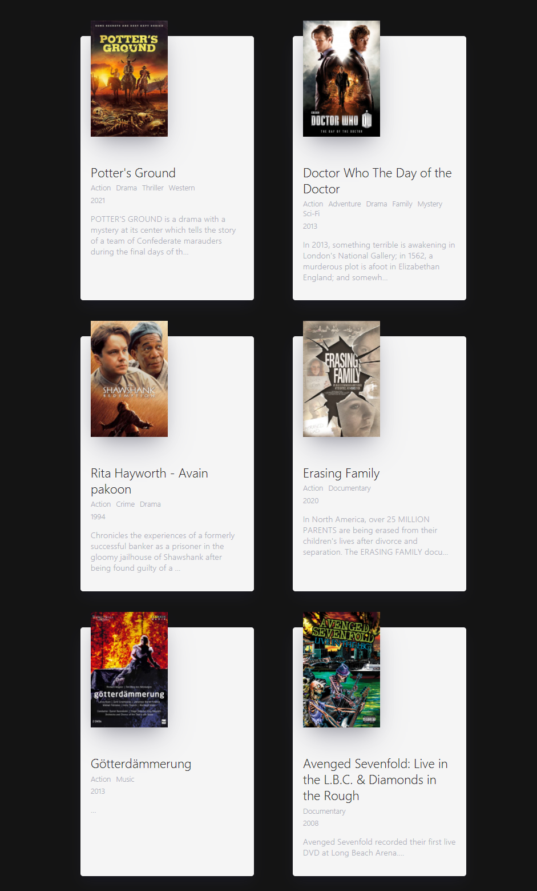

# Movie App 2021

React JS Fundamentals Course

## [Link](https://shj3497.github.io/movie-web/)



영화정보를 담고 있는 사이트에서 데이터를 받아와서 state에 세팅을 해주었다.  
영화 API 사이트 : https://yts.movie/

```jsx
class App extends Component {
  state = {
    isLoading: true,
    movies: [],
  };

  getMovies = async () => {
    // const movies = await axios.get('https://yts-proxy.now.sh/list_movies.json');
    // console.log(movies.data.data.movies);
    const {
      data: {
        data: { movies },
      },
    } = await axios.get(
      "https://yts-proxy.now.sh/list_movies.json?sort_by=rating"
    );

    this.setState({
      isLoading: false,
      movies: movies,
    });
  };

  componentDidMount() {
    this.getMovies();
  }
}
```
